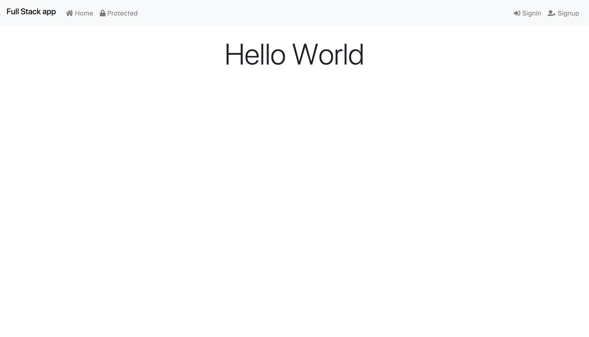

# React Full Stack App Boilerplate

This project aims to help beginners to get started on a full stack app with React, Redux, Express and MongoDB

[Live App](https://react-full-stack-boilerplate.herokuapp.com/)



## Getting Started

### Prerequisites

* [yarn](https://yarnpkg.com/lang/en/) or [npm](https://www.npmjs.com/)
* [node](https://nodejs.org/en/)
* [mocha](https://mochajs.org/)

### Installing

```sh
yarn
cd client && yarn
```

### Running the app locally

First, you need to connect your own database using [mLab](https://mlab.com/), if you don't know how to do it, follow this [tutorial](https://beta.freecodecamp.org/en/challenges/mongodb-and-mongoose/create-an-online-database-using-mlab)

Then modify the object in `./server/config.js` :

```js
{
    'port': process.env.PORT || 3000,
    'database': process.env.MY_DATABASE_LINK,
    'jwt': {
        'secret': 'my_secret_key'
    }
}
```

**WARNING** : The database link does include your username and password, your link must be an **environment** variable !

**SECOND WARNING** : Your jwt secret key should be an environment variable too ! This is used for your authentication. For more explanations, go [here](https://github.com/themikenicholson/passport-jwt).


```sh
yarn dev
```

Open a second terminal window and execute this command : 

```sh
cd client && yarn start
```

### Running the tests

For now, just the backend has been partially tested.

```sh
yarn test
```

### Technologies and frameworks used

* [Create React App](https://github.com/facebookincubator/create-react-app)
* [Redux](https://redux.js.org/) 
* [React](https://reactjs.org/)
* [React Router](https://reacttraining.com/react-router/)
* [Bootstrap](https://getbootstrap.com/)
* [Express](https://expressjs.com/)
* [Mongoose](http://mongoosejs.com/)
* [Font Awesome](https://fontawesome.com/)

## How to ...

### ... Add a flash message

```js
import { flash } from './client/src/';

flash('This is a flash message');
```

By default, it displays a Bootstrap *success* alert. But you can give a second parameter to the function to customize the alert.

```js
flash('Fatal Error', 'danger');
flash('You must be logged to acces that page', 'warning');
```

### ... Add a reducer

Create your reducer in `./client/src/reducers` then in `./client/src/index.js` import your reducer and modify this line :

```
const rootReducer = combineReducers({auth, messages, errors, /* ADD YOUR REDUCER HERE */});
```

More how tos are coming...

## Authors

* [Thomas Lombart](https://github.com/thomlom)
